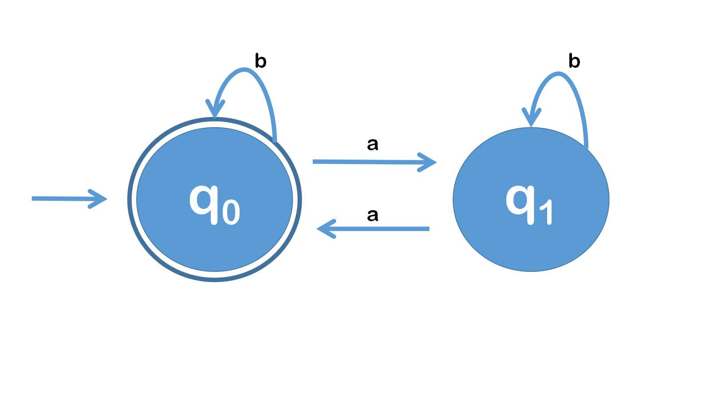
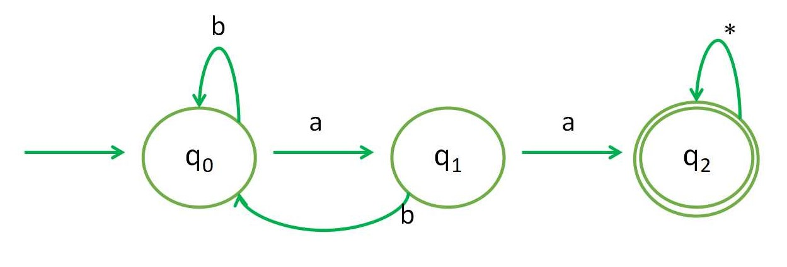
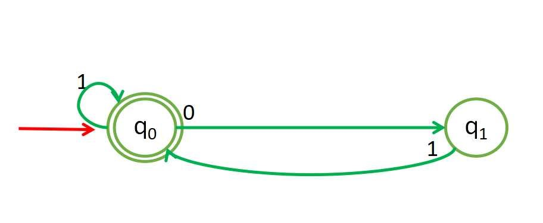
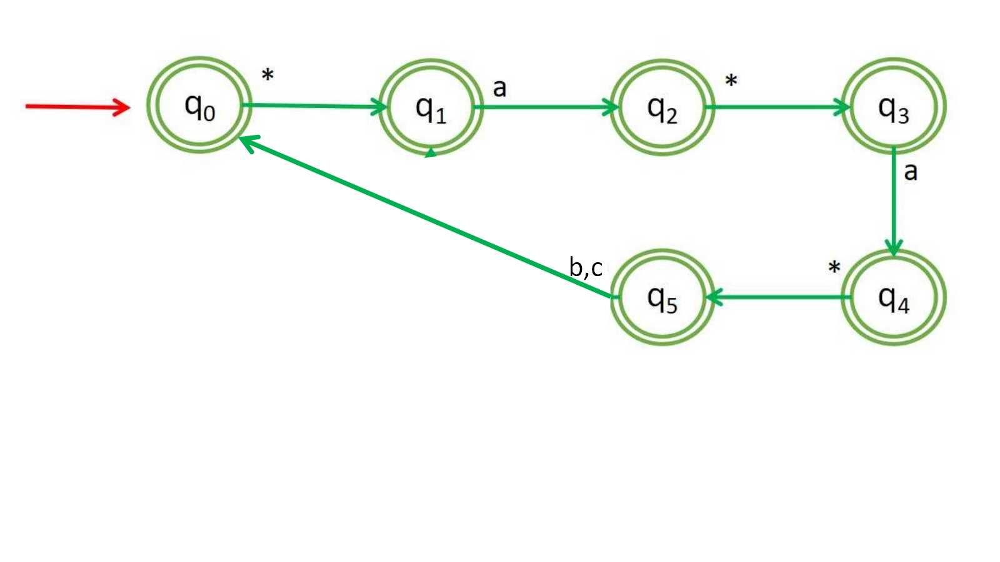
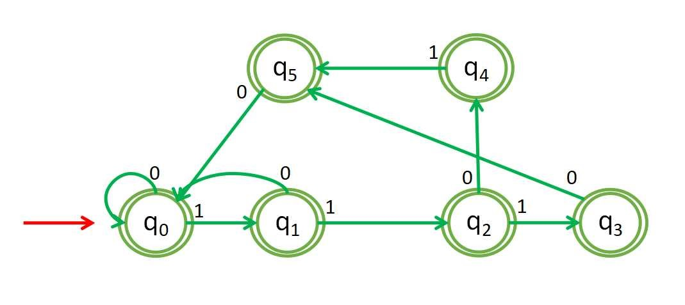
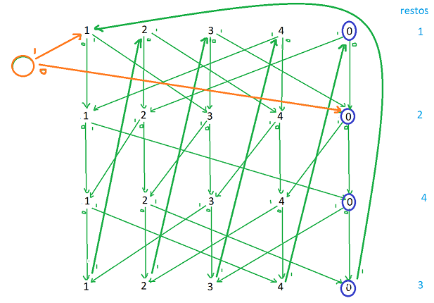

# Discreta II Clase Practica #2

Para demostrar que un autómata reconoce las cadenas del lenguaje es necesario demostrar que si una cadena termina en un estado que es final pertenece al lenguaje y que una cadena que pertenece al lenguaje es reconocida por el autómata.

## Ejercicio 1

> 1. Construya un autómata que reconozca el lenguaje de las cadenas sobre el alfabeto {a, b} que:
>    1. Tienen una cantidad par de "a"

`Demostración por inducción (si una cadena termina en un estado que es final pertenece al lenguaje).`

- Caso base: $n=0$, $n=1$, $n=2$, la cadena vacía, $b$ y la cadena $aa$ son reconocidas
- Hipótesis: supongamos que una cadena de longitud $k$ que termina en un estado final pertenece al lenguaje
- Tesis: una cadena de longitud $k+1$ que termina en un estado final pertenece al lenguaje.

Para demostrar la tesis tenemos una cadena de tamaño $k+1$, tomemos el último caracter de la cadena y distingamos dos casos:
- El caracter es $b$: eso significa que la cadena de longitud $k$ hasta ese caracter termina en $q_0$ porque el estado que llega a $q_0$ con una $b$ es el mismo $q_0$, y como este es final y la cadena hasta dicho caracter es de longitud $k$ entonces pertenece al lenguaje, y como al añadirle una $b$ no modifica la paridad de la cantidad de $a$ en la cadena esta cadena completa de longitud $k+1$ también pertenece al lenguaje
- El caracter es $a$: eso significa que la cadena de longitud $k$ hasta ese caracter termina en $q_1$ porque es el estado que llega a $q_0$ con una $a$, y por tanto hasta este momento la cantidad de $a$ en la cadena es una cantidad impar, por lo cual, al adicionar una $a$ cambia la paridad de este caracter y dicha cadena pertenece al lenguaje

`Demostración (si una cadena pertenece al lenguaje termina en un estado que es final en el autómata).`

Notemos dada la estructura del autómata que el caracter $a$ es el único que hace cambiar de estado, por lo cual, tomemos la cadena y eliminemos las $b$, luego, como la cantidad de $a$ es par analicémosla de 2 en 2, en cada caso el autómata empieza en $q_0$, com la 1ra $a$ pasa a $q_1$ y con la 2da a $q_0$ de nuevo, y es fácil ver que este comportamiento se repite con cada par de $a$, por tanto la cadena después de la última $a$ termina en un estado que es final, por lo cual es reconocida por el autómata.

>    2. Tienen una cantidad impar de "a" e impar de "b"

Definamos antes de demostrar lo que representan los estados:
- $q_0$: cantidad par tanto de $a$ como de $b$
- $q_1$: cantidad par de $a$ e impar de $b$
- $q_2$: cantidad par de $b$ e impar de $a$
- $q_3$: cantidad impar tanto de $a$ como de $b$

`Demostración (si una cadena termina en un estado que es final pertenece al lenguaje).`

Vamos a hacer dos demostraciones, una teniendo en cuenta las $a$ y otra teniendo en cuenta las $b$.

Según la configuración de nuestro autómata si tomamos en cuenta las $a$ podemos tratar los estados $q_0$ y $q_1$ como uno solo, ya que entre ellos solo existen transiciones con $b$ y de ellos a los otros dos estados no existen transiciones con $b$, análogamente con $q_2$ y $q_3$.

Sea $s'$ la nueva cadena solo con $a$ y los estados $Q_0$ y $Q_1$ la unión de los estados $q_0$-$q_1$ y $q_2$-$q_3$ respectivamente, luego, es fácil ver que como entre $Q_0$ y $Q_1$ solo hay transiciones con $a$ pues si una cadena termina en $Q_0$ significa que tiene una cantidad par de $a$ y en $Q_1$ si tiene una cantidad impar.

Análogamente ocurre al analizar cadenas solo con $b$, pero esta vez los estados unidos serán $q_0$-$q_2$ y $q_1$-$q_3$, lo cual podemos hacerlo por lo planteado anteriormente con $a$, y concluimos que en ambos casos que los estados $q_2$-$q_3$ y $q_1$-$q_3$ tienen una cantidad impar de $a$ y $b$ respectivamente, por lo que si tomamos su intersección que es $q_3$ cumplirá con ambas condiciones. Por tanto, si una cadena termina en $q_3$ pertenece al lenguaje

`Demostración (si una cadena pertenece al lenguaje termina en un estado que es final en el autómata).`

Si una cadena pertenece al lengiaje significa que tiene una cantidad impar de $a$ y de $b$, lo cual, por lo anteriormente demostrado implica que termina en el estado $q_3$, el cual es un estado final en el autómata y por tanto es reconocida.

>    3. Tienen dos "a" consecutivas en algún lugar de la cadena

`Demostración por inducción fuerte (si una cadena termina en un estado que es final pertenece al lenguaje).`

Apliquemos inducción fuerte en la longitud de la cadena:

- Caso base: $n=2$ la cadena $aa$ termina en un estado final y pertenece al lenguaje
- Hipótesis: hasta $n=k$ se cumple que si una cadena termina en un estado final entonces esta pertenece al lenguaje
- Tesis: una cadena de longitud $n=k+1$ que termina en un estado final pertenece al lenguaje

Como los caracteres de la cadena pertenecen al alfabeto entonces termina en $aa$, $ab$ o $b$, analicemos cada uno de estos casos:
- Si termina en $aa$ es más que obvio que dicha cadena pertenece al lenguaje
- En el caso de $ba$ vemos que, si lo último que leyó fue $a$ significa que pudo haber venido de $q_1$ o del propio estado final $q_2$, pero como antes había leído una $b$ y no existen transiciones a $q_1$ con una $b$ significa que la cadena antes de leer $ba$ se encontraba en el estado final $q_2$ y como su longitud es menor que $k$ entonces esta pertenece al lenguaje por hipótesis de inducción
- Por último, si leyó una $b$ significa que al estado final solo pudo llegar desde el propio estado final, y como la longitud de la cadena hasta este caracter es $k$, por hipótesis de inducción pertenece al lenguaje.

`Demostración (si una cadena pertenece al lenguaje termina en un estado que es final en el autómata).`

Si una cadena pertenece al lenguaje entonces en alguna parte debe tener la subcadena $aa$, por tanto, siendo $s$ la cadena completa que leerá el autómata podemos decir que $s=xaay$ donde esta subcadena $aa$ es la primera que aparece en $s$, con $x,y$ cadenas sobre el alfabeto en cuestión, pudiendo ser vacías

Nótese que al empezar a leer $x$ el autómata se encuentra en $q_0$, demostremos que cuando termine de leer esta subcadena terminará en $q_0$. Es fácil deducir que si en la división antes hecha de $s$, la subcadena $aa$ entre $x$ y $y$ es la primera $aa$ en $s$ significa que: $x$ termina en b y en ella no existe $aa$, de lo que podemos deducir que después de una $a$ siempre vendrá una $b$ y después de una $b$ pueden existir cualquier cadena formada solo de $b$, y si analizamos el comportamiento del autómata, si inicialmente detecta solo caracteres $b$ se quedará en $q_0$, al detectar una $a$ y luego una $b$ pasará a $q_1$ pero regresará a $q_0$, y se repite el comportamiento a lo largo de $x$, por tanto, terminará de leer esta subcadena en $q_0$.

Es fácil ver que al leer la subcadena $aa$ termina el autómata en $q_2$, y luego, independientemente de como esté conformada $y$, se quedará en $q_2$ por lo que será reconocida.

>    4. Tienen dos "a" consecutivas en algún lugar de la cadena, pero no al final

`Demostración (si una cadena termina en un estado que es final pertenece al lenguaje).`

Nótese que si empezamos en $q_0$, para llegar a alguno de los estados finales es necesario pasar por $q_1$ y $q_2$ dada la estructura de nuestro autómata, y por estos estados solo se puede transitar y llegar a $q_2$ habiendo reconocido la subcadena $aa$.

Una vez estando el autómata en $q_2$, la única forma en que terminó en uno de los estados finales es que después de este punto 2 al reconocer la subcadena $aa$ nuevamente volvió a $q_2$, si demostramos esto habremos demostrado que si una cadena termina en un estado que es final pertenece al lenguaje.

Diferenciemos algunos comportamientos del autómata según el estado en que se encuentre y los caracteres que lee:

1. A partir de $q_2$ recién acabó de reconocer una subcadena $aa$, en caso de leer caracteres $a$ se mantendrá en este estado, tomemos entonces el primer caracter $b$ que lee desde este punto, el cual garantizamos que existe porque tenemos como hipótesis que el autómata reconoció la cadena y $q_2$ no es final
2. En este punto nos encontramos en $q_3$ que es un estado final y sabemos que habremos leído $aa$ y lo último leído fue $b$, así que tenemos dos casos según el caracter que leamos en caso que no se termine la cadena, si es una $b$ nos mantenemos repitiendo el comportamiento **2**, de lo contrario, si lee una $a$ pasa el autómata a $q_4$
3. Estando en $q_4$ sabemos que hemos leído solo una $a$ pero anteriormente en la cadena habíamos leído $aa$, por tanto este estado es final, sin embargo, si a partir de este punto leemos una $b$ el autómata pasa a $q_3$ y hacemos el comportamiento **2**, en cambio, si se lee una $a$ ya habríamos leído como última subcadena $aa$, lo cual no puede ser final, por lo que el autómata pasa a $q_2$ y repetimos el comportamiento **1**

Queda demostrado que cada vez que el autómata independientemente de su posición en la cadena, cada vez que lee $aa$ pasa a terminar en $q_2$ el cual no es final, y como se garantiza que se termina en un estado final entonces la cadena no termina en $aa$, sin embargo $aa$ es una subcadena, por lo tanto, pertenece al lenguaje

`Demostración (si una cadena pertenece al lenguaje termina en un estado que es final en el autómata).`

Como la cadena pertenece al lenguaje $\implies$ en alguna posición de la cadena contiene $aa$, por lo que pasará por $q_2$ pero esta subcadena no es final. Tomemos la última aparición de $aa$ en la cadena, la cual estará seguida de $b$ para garantizar que la cadena pertenezca al lenguaje, y por los comportamientos anteriormente descritos del autómata sabemos que en este punto el autómata se encuentra en $q_3$, y como la única forma de que la cadena no termine en un estado que no es final es que en la cadena vuelva a aparecer $aa$ (lo cual no va a pasar porque ya tomamos su última aparición), desde este punto, o la cadena termina en $q_3$ o $q_4$ y ambos son estados finales.

## Ejercicio 2

> Construya un autómata que reconozca el lenguaje L de las cadenas que son el resultado de concatenar un número positivo de veces la cadena "ab"

(Demostrado en clase práctica)

> 1. Construya un autómata que reconozca el lenguaje de las cadenas que son el resultado de concatenar una cadena del lenguaje L y una cadena del lenguaje de todas las posibles cadenas sobre el alfabeto  {a, b}

(Demostrado en clase práctica)

## Ejercicio 3

> Construya un autómata que reconozca el lenguaje de las cadenas *x2y* donde *x* y *y* son cadenas sobre el alfabeto {0, 1} tal que: 
> 1. El número que representa cada una es divisible por 3.

Sean $q_0$ el estado inicial y $p_0$ estado final. Demostremos que el estado $q_i$ que representa que $x$ deja resto $i$ módulo 3 y $p_i$ que $y$ deja resto $i$ módulo 3.

Comenzamos en $q_0$ el cual asumimos que representa que el número hasta entonces deja resto 0 módulo 3, al venir un cero no varía esto, sin embargo, al leer un 1 pasa a $q_1$, en el cual asumimos que la cadena deja resto 1 módulo 3, si entonces llega un 1 es equivalente en la cadena a tomar el número, multiplicarlo por 2 y sumarle 1, por lo que retornará a $q_0$, en cambio si lee 0 significa que se multiplica por 2 el número, por lo que pasa a $q_2$ el cual asumimos que representa resto 2 módulo 3. Estando en $q_2$ si llega 0 el número pasa a dejar resto 1 módulo 3, y si llega un 1 sigue dejando resto 2. Análogamente se demuestra la cadena $y$ en el caso de los $p_i$

`Demostración (si una cadena termina en un estado que es final pertenece al lenguaje).`

Notemos que si la cadena terminó en un estado final significa que en algún momento pasó del estado $q_0$ a $p_0$, y por lo anteriormente demostrado significa que determinó que el número de la cadena $x$ era congruente 0 módulo 3 y como terminó en $p_0$ que es final entonces determinó que $y$ era múltiplo de 3, por tanto la cadena pertenece al lenguaje

`Demostración (si una cadena pertenece al lenguaje termina en un estado que es final en el autómata).`

Como la cadena $x$ es divisible por 3, por lo anteriormente demostrado al terminar de leerla el autómata se encontrará en $q_0$, luego al leer 2 pasará a $p_0$ y dado que $y$ también es divisible por 3, al terminar de leer $y$ y por tanto la cadena completa terminará en $p_0$ el cual es un estado final y por tanto la cadena es reconocida por el autómata

> 2. \* La suma de los números representados por las cadenas $x$ y $y$ es divisible por 3

Nótese que el autómata es semejante al anterior, solo que en este caso el número que represena la subcadena $x$ puede dejar cualquier resto módulo 3, y por tanto, desde cualquiera de los $q_i$ se puede acceder a un autómata al reconocer 2 en la cadena, que no es más que el primero pero en este caso, se analizará la cadena $y$, la cual depende del resto que le haya dejado la cadena $x$ para definir su estado final, los estados tienen el mismo significado que el autómata anterior, el subíndice de cada uno representa el resto que deja la cadena que finaliza en ese estado módulo 3

`Demostración (si una cadena termina en un estado que es final pertenece al lenguaje).`

Si una cadena terminó en un estado final significa que reconoció un 2 en algún punto, por lo que se pueden diferenciar las cadenas $x$ de $y$, luego, según el resto que haya dejado $x$ (o sea, el $q_i$ tal que se hizo una transición con 2), el estado final de los 3 conjuntos de 3 estados que son los encargados de analizar la cadena $y$ son los que, su $i$ complementa a la $i$ de dicho estado $q_i$ del cual hubo una transición con 2 para que la suma de ambos restos sea divisible por 3, con lo cual, dicha cadena una vez reconocida podemos asegurar que pertenece al autómata

`Demostración (si una cadena pertenece al lenguaje termina en un estado que es final en el autómata).`

Supongamos que la cadena $s=x2y$ pertenece al lenguaje, luego de leer 2 el autómata habrá salido de un estado $q_i$, y a partir de este momento comenzará a leer la subcadena $y$ y a transitar por los estados que representan los restos de $y$ módulo 3, y se distinguen 3 casos:
- $x \equiv 0 \ mod(3)$ por lo que, habrá reconocido 2 desde $q_0$ y sabemos que en este caso debe ocurrir que $y \equiv 0 \ mod(3)$ en el autómata la cadena terminará en un estado final $p_0$
- $x \equiv 1 \ mod(3)$ por lo que, habrá reconocido 2 desde $q_1$ y sabemos que en este caso debe ocurrir que $y \equiv 2 \ mod(3)$ en el autómata la cadena terminará en un estado final $r_2$
- $x \equiv 2 \ mod(3)$ por lo que, habrá reconocido 2 desde $q_2$ y sabemos que en este caso debe ocurrir que $y \equiv 1 \ mod(3)$ en el autómata la cadena terminará en un estado final $t_1$

## Ejercicio 4

> Sea Q el conjunto de todas las listas no vacías de enteros positivos y L el conjunto de todas las cadenas sobre el alfabeto {0, 1}. Se define la función $f: Q \rightarrow L$ tal que:
>    
> $f(l) = (1)^{a_1}0(1)^{a_2}0 \ldots 0(1)^{a_k}$ donde $l = \{ a_1, a_2, ..., a_k \} \in Q$
> 
> Por ejemplo, $f(2, 3, 2) = 110111011$.
>    
> Construya el autómata que reconoce el lenguaje de las cadenas que pertenecen a la imagen de f.

Supongamos por simplicidad que la cadena vacía pertenece al lenguaje, de lo contrario es solo agregar un estado inicial que tenga transición con 1 a $q_0$

`Demostración (si una cadena termina en un estado que es final pertenece al lenguaje).`

Procedamos por inducción fuerte al tamaño de la cadena:
- Para $n=1$ se cumple con la cadena 1
- Supongamos que hasta $n=k$ se cumple que si la cadena es reconocida por el autómata entonces pertenece al lenguaje
- Demostremos que se cumple para $n=k+1$

Nótese que si la cadena es reconocida por el autómata entonces finaliza en el estado $q_0$ que es final, y hasta él solo se llega con transiciones de 1. Luego, la cadena reconocida termina en 11 o 01:
- En caso que termine en 11 observamos que la subcadena de tamaño $k$ termina en $q_0$, por lo cual es reconocida por el autómata y por hipótesis de inducción pertenece al lenguaje, o sea, existe una lista $l_0$ tal que corresponde a esa subcadena, y dicha lista, al sumarle 1 a su último elemento corresponde a la cadena en cuestión, y por tanto pertenece al lenguaje
- En caso que termine en 01, si termina en $q_0$ con una transición 1 pudo haber venido de $q_0$ o de $q_1$, pero como anteriormente leyó un 0 entonces vino de $q_1$, estado a donde solo se llega con transición 1 desde $q_0$, o sea, un estado final, por lo que la subcadena de tamaño $k-1$ (porque $q_1$ no es estado inicial) pertenece al lenguaje, es decir, existe una lista  $l_0$ que corresponde a la cadena, luego, al adicionarle el elemento 1 a la lista da como resultado la cadena que estabamos analizando de longitud $k+1$, por lo que pertenece al lenguaje

`Demostración (si una cadena pertenece al lenguaje termina en un estado que es final en el autómata).`

Procedamos por inducción, teniendo como casos base $n=1$ y $n=2$ con las cadenas $1$ y $11$. Supongamos que para $n=k-1$ y $n=k$ se cumple, y demostremos que para $n=k+1$ cumple que si una cadena pertenece al lenguaje termina en un estado que es final en el autómata.

Si la cadena de longitud $k+1$ pertenece al lenguaje entonces diferenciemos los casos en que termine en 11 o 01:
- En caso que termine en 11, notemos que la subcadena de tamaño $k$ pertenece al lenguaje, ya que el último elemento en su lista correspondiente $l$ sería al menos 1 $\implies$ termina en el estado final $q_0$, luego al leer 1 vuelve a caer en $q_0$, por lo que la cadena de tamaño $k+1$ sería reconocida
- En el caso de 01, según la configuración de las cadenas del lenguaje, antes del 0 vendría un 1, por lo que la subcadena de tamaño $k-1$ pertenece al lenguaje por la justificación anterior y es reconocida por el autómata por hipótesis de inducción, en este punto se encuentra en $q_0$, al leer 0 pasa a $q_1$ y finalmente, con 1 termina en $q_0$ el cual es estado final, por tanto queda demostrado.

> Construya el autómata que reconozca el lenguaje de las cadenas sobre el alfabeto $\{a, b, c\}$ tales que contengan una $a$ en todas las posiciones pares excepto en las que son múltiplo de 3.

`Demostración por inducción(si una cadena termina en un estado que es final pertenece al lenguaje).`

Nótese que las cadenas: $*$, $*a$, $*a*$, $*a*a$, $*a*a*$, $*a*a*b$, $*a*a*c$ cumplen. Supongamos que para un cierto valor $k$ se cumple que la cadena que tiene longitud $k$ y es reconocida por el autómata pertenece al lenguaje, probemos que para $k+1$ también se cumple.

Separemos los siguientes casos:
- $k+1 \equiv 0 \ mod(6)$ luego la cadena terminó en $q_0$, por lo que le fue antecedida por $q_5$ el cual es un estado final $\implies$ la subcadena de tamaño $k$ pertenece al lenguaje. Luego, la posición $k+1$ es par múltiplo de 3, por lo que según las condiciones del lenguaje dicha posición no contiene $a$, y para llegar al estado $q_0$ en que fue reconocida la cadena en el autómata solo hay transición posible con $b$ o $c$ por lo que dicha cadena de tamaño $k+1$ también pertenece al lenguaje
- $k+1 \equiv 1,3,5 \ mod(6)$ en este caso la cadena terminó en uno de los estados $q_1,q_3,q_5$ respectivamente, a los cuales solo se accede desde el estado $q_0,q_2,q_4$ respectivamente hasta los cuales, la subcadena de tamaño $k$ fue reconocida y por hipótesis de inducción pertenece al lenguaje, pero esta posición $k$ es par, en la cual hay restricción en el lenguaje, pero en la siguiente posición ($k+1$) no, por tanto, las transiciones $q_0-q_1$, $q_2-q_3$, $q_4-q_5$ en el autómata, que son posibles con cualquier caracter del alfabeto, son válidas para que la cadena de longitud $k+1$ pertenezca al lenguaje
- $k+1 \equiv 2,4 \ mod(6)$ en estos casos la cadena terminó en los estados $q_2,q_4$ respectivamente, a los cuales solo pudo llegar desde los estados $q_1,q_3$, y dichos estados son finales y por hipótesis de inducción, la cadena que en ambos se reconoció de longitud $k$ pertenece al lenguaje, sin embargo, la posición $k+1$ es par pero no múltiplo de 3, por lo que según las restricciones del lenguaje debería continuar en ambos casos el caracter $a$, el cual, es necesario leer en el autómata desde los estados $q_1,q_3$ para llegar a los estados $q_2,q_4$ respectivamente, y por tanto, sus cadenas de longitud $k+1$ son reconocidas

`Demostración por inducción (si una cadena pertenece al lenguaje termina en un estado que es final en el autómata).`

Tomemos como caso base las cadenas de longitud 1 hasta 6 como en la inducción anterior, las cuales es fácil probar que dado que pertenecen al lenguaje $\implies$ son reconocidas por el autómata. Tomemos como hipótesis de inducción que para $n=k$ se cumple y veamos que ocurre con $n=k+1$, para ello diferenciemos los siguientes casos:

- $k+1 \equiv 0 \ mod(6) \implies$ termina en $q_0$ En este caso la subcadena de tamaño $k$ pertenece al lenguaje y es reconocida en el autómata en $q_5$ por la hipótesis de inducción, pero k+1 es una posición par múltiplo de 3 y como sabemos que pertenece al lenguaje en esa posición no contiene $a$ por tanto solo puede haber $b,c$, y en el autómata la transición $q_5-q_0$ se realiza con $b,c$ por tanto la cadena es reconocida porque $q_0$ es final.
- $k+1 \equiv 2,4 \ mod(6) \implies$ termina en $q_2$ o $q_4$ En este caso la subcadena de tamaño $k$ pertenece al lenguaje y es reconocida en el autómata por $q_1$ y $q_3$ respectivamente por la hipótesis de inducción, pero k+1 es una posición par no múltiplo de 3 y como sabemos que pertenece al lenguaje en esa posición contiene únicamente $a$, y dado que en el autómata la transición $q_1-q_2$ y $q_3-q_4$ se realiza con $a$ la cadena es reconocida porque $q_2$ y $q_4$ son estados finales.
- $k+1 \equiv 1,3,5 \ mod(6) \implies$ termina en $q_1,q_3,q_5$ En este caso la subcadena de tamaño $k$ pertenece al lenguaje y es reconocida en el autómata por $q_0,q_2,q_4$ respectivamente por la hipótesis de inducción, pero k+1 es una posición impar y como sabemos que pertenece al lenguaje en esa posición el lenguaje no ofrece restricción, y dado que en el autómata la transición $q_0-q_1,q_2-q_3$ y $q_4-q_5$ se realiza con cualquier caracter la cadena es reconocida porque $q_1,q_3$ y $q_5$ son estados finales.

## Ejercicio 8

> \* Construya el autómata que reconoce el siguiente lenguaje sobre el alfabeto {0, 1}
> 1.  El conjunto de todas las cadenas tal que cada bloque de cinco símbolos consecutivos contenga al menos dos "0"

> 2.  El conjunto de todas las cadenas cuyo decimo símbolo desde la derecha es "1"

Para hacer este autómata es necesario almacenar todas las posibles subcadenas de longitud 10 en las que puede terminar la cadena porque al ser autómata finito determinista posee memoria finita y no puede almacenar información que no sea únicamente la de los estados, por lo cual, el autómata tendría $2^{10}$ estados.

> 3.  El conjunto de todas las cadenas que comienzan o terminan con "01"

> 4.  El conjunto de todas las cadenas tal que el número de "0" es divisible por 5 y el número de "1" es divisible por 3

## Ejercicio 9

> \*\* Construya el autómata que reconoce el siguiente lenguaje sobre el alfabeto {0, 1}:
>
> 2.  El conjunto de todas las cadenas, que interpretadas en reverso como un número binario, son divisibles por 5. Por ejemplo, las cadenas "0", "10011", "1001100", y "0101" pertencen a este lenguaje.

`Estructura del Autómata`

Las columnas representan todos los restos módulo 5 y las filas los resto de las potencias de 2 módulo 5.

Nótese que los restos de las potencias de 2 modúlo 5 y todos los restos módulo 5 están independientes, pero vamos a establecer una relación entre ellos a partir de un conjunto de comportamientos:

**Comportamiento 1:** *"Si el autómata se encuentra en la fila $i$, al leer el siguiente caracter se encontrará en la fila $j$ tal que $j \equiv i+1 \ mod(4)$"*

`Idea detrás de ello: `Los restos de las potencias de 2 con 5 son $\{1,2,4,3\}$, son cíclicos y siguen estríctamente ese orden, y dado que en una cadena binaria leída en reverso las potencias de 2 siguen ese orden y se encuentran todas consecutivas (o sea que para toda posición $i$ esta representa la potencia $2^i$ y es seguida por $2^{i+1}$) entonces se cumple que por cada transición el autómata pasa de la fila $i$ a la fila $j$

**Comportamiento 2:** *"De un estado en la posición $[i,j]$ en el autómata, siendo $i$ el resto que deja la cadena $mod(5)$ y $j$ el resto de la última potencia de 2 leída, solo es posible transición al estado $[i+k,k]$ suponiendo que el caracter leído es 1 y corresponde a la potencia de 2 con resto $k \ mod(5)$ o al estado $[i,k]$ si el caracter leído es 0"*

`Idea detrás de ello:` Al tomar una cadena binaria en reverso con un resto $i$, y en caso que se lea 1 sumarle la potencia $2^l \equiv k \ mod(5)$, esta nueva cadena dejará resto $i+k \ mod(5)$ pero es necesario que el autómata sepa en cada momento cual es el resto de la próxima potencia de 2 que leerá, *(dado que en este tipo de autómatas la memoria depende únicamente de los estados)*, por lo cual, para cada resto de la cadena módulo 5 en que este pueda estar, existe un estado para cada resto de las potencias de 2, y que el autómata, por el **Comportamiento 1** rote entre ellos, por lo que, la transición se hará para la columna $c \equiv i+k \ mod(5)$ y la fila $k \equiv 2j \ mod(5)$

(hacer dos demostraciones)

`Demostración por inducción(en cada momento una cadena leída en el estado [i,j] deja resto i módulo 5 y la última potencia de 2 leída deja resto j).`

`Demostración por inducción(en cada momento una cadena leída deja resto i módulo 5 y la última potencia de 2 analizada deja resto j termina en el estado [i,j]).`

