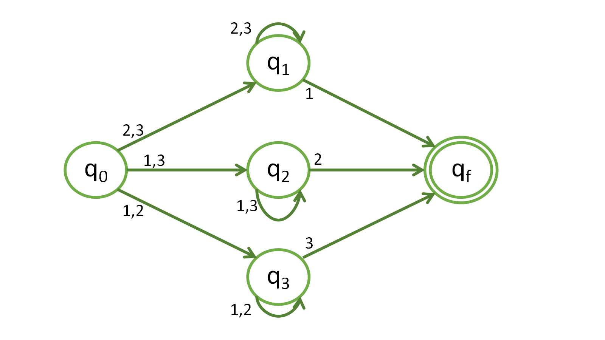

## Ejercicio 1

> Construya autómatas finitos no deterministas para reconocer los siguientes lenguajes. Trate de aprovechar al máximo la no determinación.
> - El conjunto de cadenas sobre el alfabeto $\{0,1,...,9\}$ tal que el último dígito no ha aparecido antes.

`Demostración por inducción (si una cadena termina en un estado que es final pertenece al lenguaje).`

Partimos de que la cadena en el autómata termina en un estado final $\implies$ termina en $q_f$