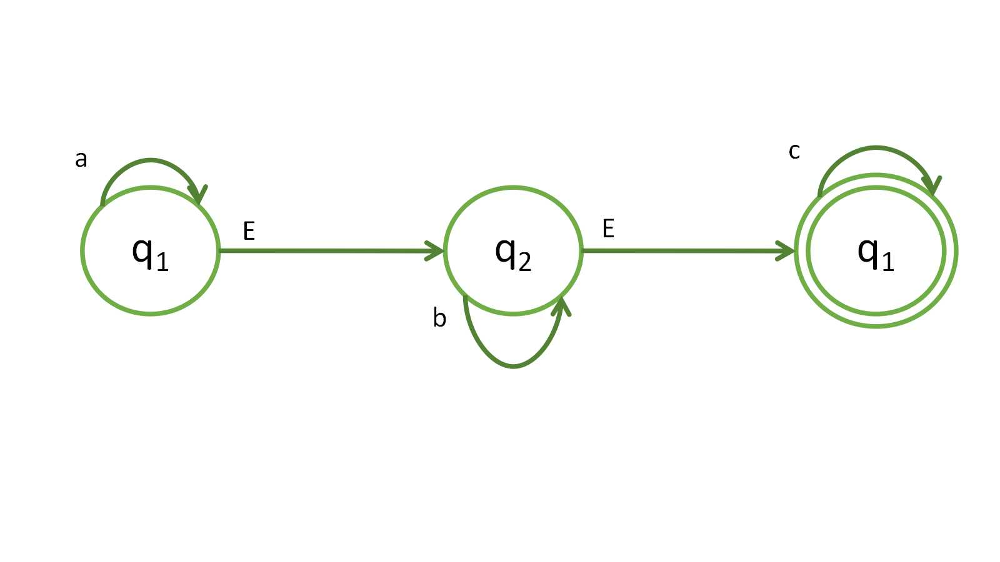
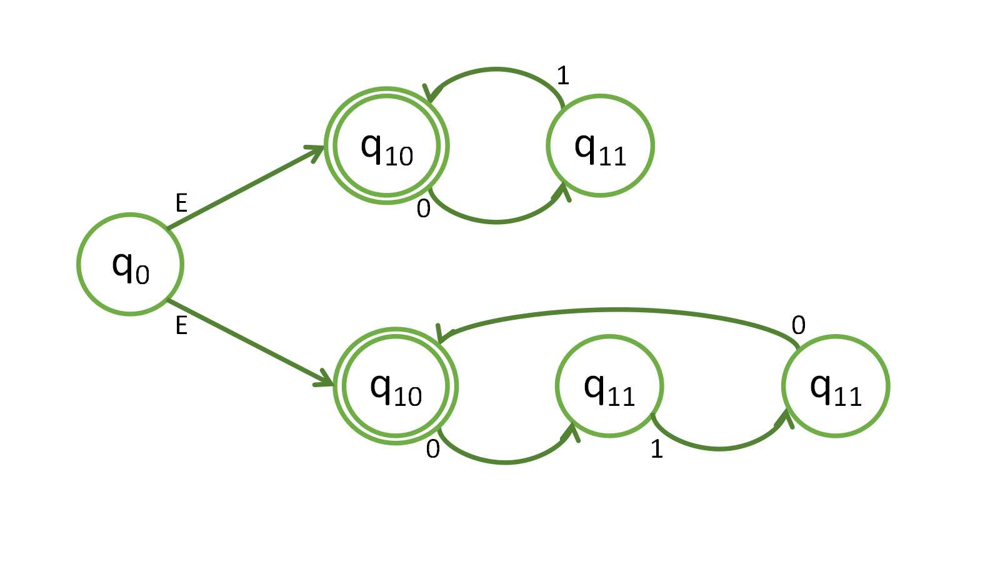
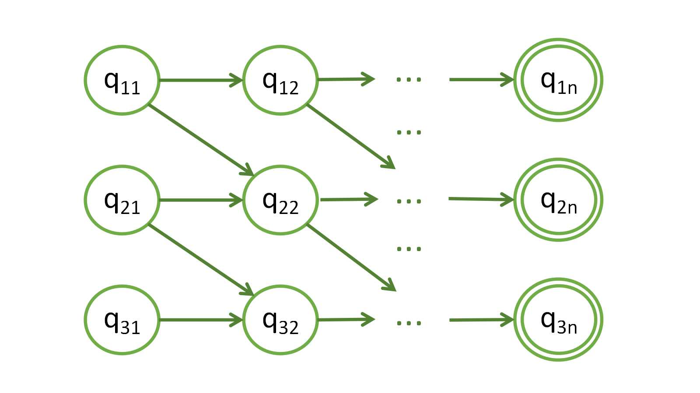

## Ejercicios teóricos

> Demuestre que las siguientes operaciones sobre lenguajes regulares son cerradas(esto es, que el resultado es un lenguaje regular). Las demostraciones deben ser formales, es decir, deben incluir la especificación del autómata que reconoce el lenguaje resultante o utilizar resultados de este propio ejercicio.

De cada una se comentará solo la idea de solución, la formalidad va por parte del lector.

Supongamos que tenemos los lenguajes regulares $L_1, L_2, \ldots, L_n$, por lo cual existen los autómatas $A_1, A_2, \ldots, A_n$ que reconocen respectivamente esos lenguajes.

### `Unión`

Tomemos cada uno de esos autómatas, y creemos un estado $Q_0$, luego, agregamos epsilon-transición desde este nodo a cada uno de los nodos iniciales de esos autómatas, y el resultado de esto será un nuevo autómata que, al entrarle una cadena perteneciente a alguno de los lenguajes anteriores, su autómata correspondiente la reconocerá y por tanto, el que creamos también $\implies$ la unión es regular.

### `Concatenación`

Para ello necesitamos un orden en el que vamos a reconocer la concatenación. Con esto ya determinado totamos en ese orden los autómatas y los estados finales de uno los unimos con epsilon-transiciones al estado inicial del próximo lenguaje.

### `Complemento`

Esta operación es aplicada a un lenguaje, y por tanto un autómata, del cual, sabemos del conjunto de estados cuales son finales y cuales no. La idea del complemento es hacer finales los estados que originalmente no lo eran, y los que eran finales hacerlos no finales, por lo cual, si una cadena no era reconocida en el autómata anterior, en este que crearemos si, y una que era reconocida ahora no lo será.

### `Intersección`

Para esta operación tomemos una matriz de tamaño $m \times n$ donde $m$ es la cantida de estados de $A$ y $n$ la cantidad de estados de $B$, luego, al asociar cada estado a una fila o una columna de la matriz podremos por cada estado $a_i$ de $A$ transitar por los estados de $B$ y viceversa, cumpliéndose en todos ellos la condición del estado $a_i$, por lo cual, el estado inicial de este nuevo autómata sería la coordenada $[0,0]$ de la matriz y los estados finales las posiciones $[a,b]$ tal que $a$ es estado final de $A$ y $b$ estado final de $B$

### `Diferencia`

La diferencia entre dos lenguajes podemos verla como cuando operamos como conjuntos, o sea, si tenemos los autómatas $A$ y $B$, entonces $A-B = \{x | x \in A, x \not \in B \}$, o sea, el autómata $A$ intersectado con $B$ complemento.

$$-*-$$

## Ejercicio 1

> Construya autómatas finitos no deterministas para reconocer los siguientes lenguajes. Trate de aprovechar al máximo la no determinación.
> - El conjunto de cadenas sobre el alfabeto $\{0,1,...,9\}$ tal que el último dígito no ha aparecido antes.

Analicemos la demostración con el alfabeto $\{1,2,3\}$, ya que el análisis con el alfabeto del ejercicio es análoga.

`Demostración (si una cadena termina en un estado que es final pertenece al lenguaje).`

Partimos de que la cadena en el autómata termina en un estado final $\implies$ termina en $q_f$

A este estado solo pudo llegar desde $q_1,q_2$ o $q_3$, supongamos que el estado anterior fue $q_2 \implies$ el último caracter de la cadena leído fue 2. Si el autómata se encuentra en $q_2$, pudo haber sido antecedido por el mismo estado $q_2$ porque existe esa transición con los valores 1,3, o por el estado $q_0$, el cual es inicial, también con transición 1,3 $\implies$ existió una transición de este estado a $q_2$, por lo que, llegamos a que si el autómata llegó a un estado final con una cadena que termina en 2 es porque antes de este caracter no existió 2 en ninguna transición hacia el estado final $\implies$ pertenece al lenguaje.

El análisis es análogo con las otras terminaciones.

`Demostración (si una cadena pertenece al lenguaje, el autómata termina en un estado que es final).`

Podemos demostrarlo de forma directa, supongamos que la cadena termina en 3 $\implies$ no existe 3 en posiciones anteriores en la cadena.

El comportamiento del autómata es el siguiente: como el primer caracter será 1 o 3 implica que entre los estados a los que transita el autómata se encuentra $q_2$, luego a lo largo de la cadena se mantendrá en ese estado con transición a él mismo con 1,3 hasta que al llegar al último caracter de la cadena, el autómata lea 2 y transite al estado final, por lo que la cadena será reconocida.

El análisis es análogo con el resto de terminaciones de la cadena.

## Ejercicio 2

> Diseñe autómatas finitos no deterministas que reconozca el conjunto de cadenas que consisten en cero o más $a$ seguidas de cero o más $b$ seguidas de cero o más $c$. Trate de usar epsilon transiciones para simplificar su diseño.

## Ejercicio 3

> Diseñe autómatas finitos no deterministas que reconozca el conjunto de cadenas que consisten en cero o más $a$ seguidas de cero o más $b$ seguidas de cero o más $c$. Trate de usar epsilon transiciones para simplificar su diseño.

## Ejercicio 5

> La Distancia de Hamming entre dos cadenas de bits $x$ y $y$ (notación: H($x$,$y$)) es el número de lugares en que estas difieren. Por ejemplo, H(011,110) = 2. (Si |$x$| != |$y$|, entonces la distancia de Hamming es infinita.) Si $x$ es una cadena y $A$ es un conjunto de cadenas, la distancia de Hamming entre $x$ y $A$ es la distancia de $x$ a la cadena de $A$ más cercana:
>
>   $H(x,A)\stackrel{def}{=} \min \limits_{y\in A} H(x,y)$
>
>   Para cualquier conjunto $A$ $\subseteq$ {$0,1$}* y $k \geq 0$, se define:
>
>   $N_k(A) \stackrel{def}{=} \{x | H(x,A) \leq k\}$
>
>   El conjunto de cadenas con distancia de Hamming al menos $k$ de $A$. Por ejemplo $N_0$({000}) = {000}, $N_1$({000}) = {000,001,010,100}, y $N_2$({000}) = $\{0,1\}³$ - {111}.
>
>   Demuestre que si $A \subseteq$ {0,1}* es regular, entonces también lo es $N_2(A)$.

Tomemos 3 veces el autómata $Q$ del lenguaje sobre $A$ como se indica donde $q_{11}$ es el estado inicial del autómata que estamos creando y de cada transición $q_{ab}$ tenemos que $a$ representa una instancia del autómata $Q$ y $b$ el número del estado $b$-esimo del autómata $Q$ original. Sea $M$ el autómata que estamos creando.

Sea $q_{ij}$ un estado de $M$ el cual tiene transición hacia el estado $q_{i(j+1)}$ con los caracteres de la lista $l = \{a_1,a_2,\ldots, a_m\}$ (suponiendo que tenemos un alfabeto $V =\{v_1,v_2,\ldots,v_r\}$  genérico mayor que 0,1, pero con dicho alfabeto es análogo), entonces (siempre que $i < 3$) existe en $M$ una transición de este estado $q_{ij}$ hacia $q_{(i+1)(j+1)}$ con los caracteres $V - l$, o sea, los que están en el alfabeto pero no pertenecen a la lista $l$.

Hagamos un análisis al comportamiento del autómata, tomemos una cadena $w$ y pasémosla por $M$:
- Dicha cadena empieza en $q_{11}$ y, si pertenece al lenguaje $A$ terminará en $q_{1n}$, lo cual nos dice que $w$ tiene distancia de Hamming de 0 a las cadenas del lenguaje. Si en algún estado $q_{1i}$ el autómata lee un caracter que no coincide con el lenguaje $A$ entonces por lo anteriormente definido hace la transición a $q_{2(i+1)}$, y si la cadena es reconocida significa que la cadena $w$ difiere al lenguaje $A$ por un caracter, por lo cual tiene distancia de Hamming de 1.
- Si luego de haber pasado a la segunda instancia del autómata $Q$ la cadena $w$ que ya ha diferido en una posición con el lenguaje $A$ vuelve a diferir en un estado $q_{2j}$, análogo al comportamiento anterior el autómata ejecuta una transición hacia $q_{3(j+1)}$, del cual pueden pasar dos cosas, o que la cadena continue hacia el estado final $q_{3n}$, por lo que la cadena habría sido reconocida por $M$ y en este estado significa que ha diferido dos veces, por lo que tiene distancia de Hamming de 2 con el lenguaje $A$, o puede pasar que la cadena no sea reconocida, lo que indica que $w$ difirió cuando ya ha diferido 2 veces, lo cual indica que $w$ no tiene distancia de Hamming de 2