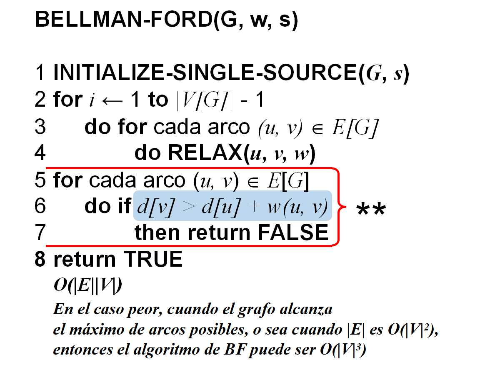
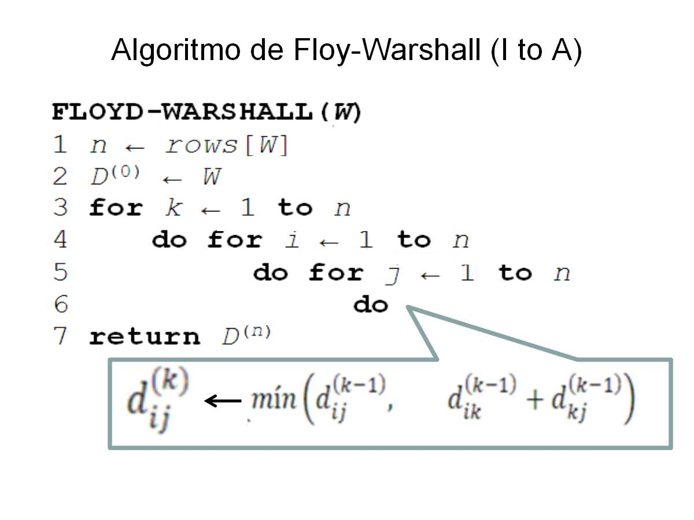

# Resumen de los algoritmos

- Grafos no Dirigidos
- Grafos dirigidos
    - Bellman-Ford
    - Floyd-Warshall
    - Ford-Fuckerson

# Grafos dirigidos
- Bellman-Ford
- Floyd-Warshall
- Ford-Fuckerson

## Bellman-Ford

### `Problema que resuelve:`

Hallar los caminos de costo mínimo hacia todos los nodos a partir de un nodo inicial dado (en caso que no exista camino hacia algún nodo se asume que su distancia mínima es $\infty$)

### `Requerimientos:`

- Grafo dirigido y ponderado
- Pueden existir ciclos de costo negativo

### `Resultado:`

- False si existe algún ciclo de costo negativo
- True, el array $\pi$ y el array de costos mínimos por nodo en caso de que no exista ningún ciclo de costo negativo

### `Cómo funciona:`

El algoritmo se sustenta fundamentalmente en lo siguiente:

- **Propiedad de la convergencia** : El costo de cada camino entre dos nodos, hallado a partir de la aplicación de RELAX converge al costo del camino de costo mínimo que los une, independientemente de que una vez alcanzado este costo se siga aplicando RELAX sobre cualquier par de nodos
- **Propiedad del RELAX** : Dado un camino de costo mínimo $\{v_0, v_1, \ldots, v_n\}$, al aplicar RELAX a cada arco en el orden de dicho camino $\implies d[v_n] = \delta[v_n]$, independientemente de que se siga aplicando RELAX sobre cualesquiera 2 nodos del grafo

La idea es aplicar RELAX a todos los arcos del grafo $|V|-1$ veces (lo cual es una cota superior de la distancia de todo camino en el grafo), de esta forma se garantiza que por la **Propiedad de RELAX** se hallen todos los caminos de costo mínimo, y en caso de haber algún ciclo de costo negativo, este será detectado luego al aplicar la **Propieda de la Convergencia**.

## Floyd-Warshall

### `Problema que resuelve:`

Hallar la distancia mínima entre todos los vértices de un grafo.

### `Requerimientos:`

- Grafo dirigido y ponderado
- No pueden existir ciclos negativos (en la versión de cp se puede detectar la existencia de ciclos negativos)

### `Resultado:`

Matriz $A$ de $n\times n$ donde en $A[i,j]$ está la distancia mínima del vértice $i$ al $j$.

### `Cómo funciona:`

Para cada vértice se recorre la matriz $A$ verificando que el valor en $A[i,j] < A[i,k] + A[k,j]$, y en caso contrario actualizar su valor, lo cual es equivalente a, en el instante $k$, cada elemento $A[i,j]$ de la matriz es el costo mínimo de los caminos de $i$ a $j$ pasando por vértices de número menor o igual que $k$.

## Flujo

### `Problema que resuelve:`

### `Requerimientos:`

### `Resultado:`

### `Cómo funciona:`

